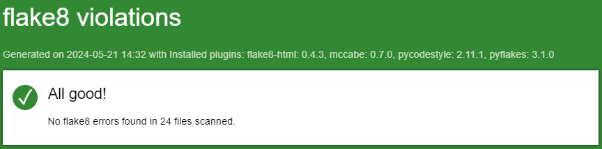
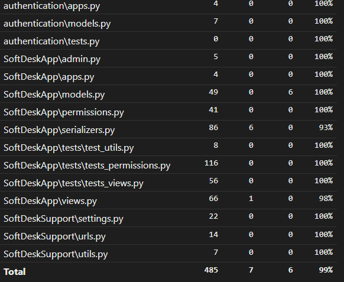

# OCR-P10 - SoftDeskSupport
#### RESTFul API using Django REST Framework

This project involves creating a secure RESTful API using Django Rest Framework. It is a project management application where users can create various resources: Projects, within which users can create Issues that can be commented on by other users. To access a project and its associated resources, users must be contributors to the specific project. Additionally, resources can only be modified by their authors.

## Prerequisites

* **python**
* **pip**

## Start project

### Install environment

#### 1 - Install poetry
`pip install poetry`

#### 2 - Install poetry
`poetry install`

#### 3 - Activate virtual environment
`poetry shell`

#### 4 - Run local server
`python manage.py runserver`

#### 5 - Run in Postman
[](https://god.gw.postman.com/run-collection/32415762-15cc7ebd-6694-414b-b0cb-93c1771fe66b?action=collection%2Ffork&source=rip_markdown&collection-url=entityId%3D32415762-15cc7ebd-6694-414b-b0cb-93c1771fe66b%26entityType%3Dcollection%26workspaceId%3Db3627675-1977-4b48-b64f-09a9ea188ea8)


## Run tests

`python manage.py test`

## Generate flake8 report
```flake8 --format=html --htmldir=flake8_report --exclude=.venv,htmlcov,*/migrations/*,settings.py```


## Generate coverage report
1. `coverage run manage.py test`
2. `coverage html`
3. Report generated > `htmlcov\index.html`

